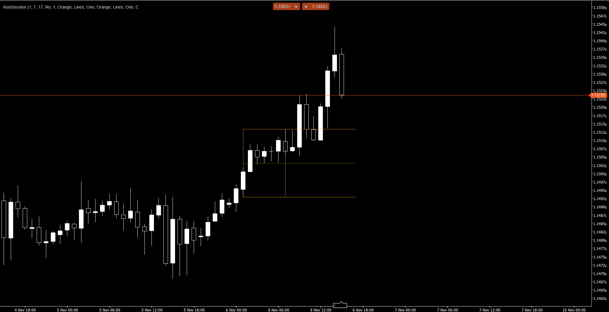
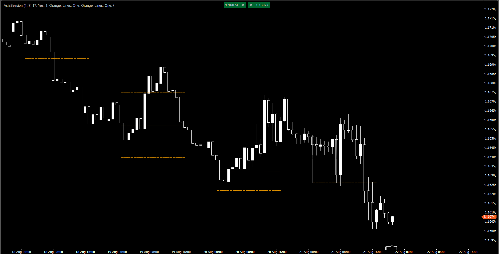
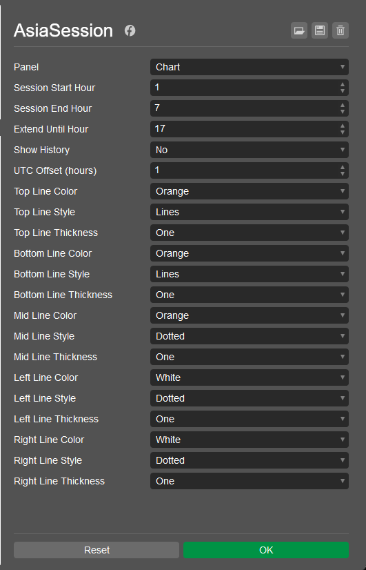

# AsiaSession Indicator

## 📌 Overview
The **AsiaSession Indicator** is a custom cTrader indicator designed to visualize the Asian trading session range.  
It highlights the **high, low, and mid levels** of the session, along with vertical boundaries for the start and end times.  
This tool is especially useful for traders applying **SMC/ICT concepts**, where Asia session levels often act as liquidity zones.

---

## ✨ Features
- Draws **complete session box**:
  - Left line (session start)
  - Right line (session end)
  - Top line (Asia high)
  - Bottom line (Asia low)
  - Mid line (Asia mid)
- Extends high/low/mid lines into the future until a user-defined time.
- Configurable **colors, styles, and thickness** for each line.
- Option to **show only the current day** or include **historical sessions**.
- Built-in **UTC offset** parameter for timezone adjustments.
- Skips weekends automatically to avoid false sessions.
- Clean **object-oriented architecture**:
  - `Enums` → line style/color/thickness definitions
  - `Helpers` → mapping enums to cTrader types
  - `Models` → line definition objects
  - `Services` → line drawing logic
  - `AsianSessionIndicator` → orchestrates everything

---

## ⚙️ Parameters

| Parameter              | Description                                      | Default |
|------------------------|--------------------------------------------------|---------|
| Session Start Hour     | Start of Asia session (local time)               | 1       |
| Session End Hour       | End of Asia session (local time)                 | 7       |
| Extend Until Hour      | Time until which lines are extended              | 17      |
| Show History           | Show historical sessions (true/false)            | false   |
| UTC Offset (hours)     | Adjust session times to your timezone            | 1       |
| Top Line Color/Style/Thickness    | Visual settings for Asia high line     | Orange / Lines / 1 |
| Bottom Line Color/Style/Thickness | Visual settings for Asia low line      | Orange / Lines / 1 |
| Mid Line Color/Style/Thickness    | Visual settings for Asia mid line      | Orange / Dotted / 1 |
| Left Line Color/Style/Thickness   | Visual settings for session start line | White / Dotted / 1 |
| Right Line Color/Style/Thickness  | Visual settings for session end line   | White / Dotted / 1 |

---

## 📂 Project Structure
```
AsiaSessionIndicator/ 
├─ Enums/ 
│ ├─ MyLineColor.cs 
│ ├─ MyLineStyle.cs 
│ └─ MyLineThickness.cs 
│ 
├─ Helpers/ 
│ └─ LineVisualMapper.cs 
│ 
├─ Models/ 
│ └─ LineDefinition.cs 
│ 
├─ Services/ 
│ └─ LineDrawer.cs 
│ 
└─ AsianSessionIndicator.cs
```
---

## 🖼️ Visualization
The indicator draws a **box around the Asian session**:
- Vertical lines mark the **start and end** of the session.
- Horizontal lines mark the **high, low, and mid levels**.
- High/low/mid lines extend into the future until the chosen `Extend Until Hour`.

See more examples in the [Screenshots](#screenshots) section.

---

## 🚀 Usage
1. Copy the project files into your cTrader custom indicators folder.
2. Compile the indicator in **cTrader Automate**.
3. Attach the indicator to your chart.
4. Adjust parameters to match your trading timezone and preferences.

---

## 📜 License
This project is released under the **MIT License**.  
You are free to use, modify, and distribute it with attribution.

---

## 🤝 Contributing
Contributions are welcome!  
If you’d like to improve visuals, add new session types (London, New York), or optimize performance, feel free to fork the repo and submit a pull request.

---

## 💡 Notes
- Default settings visualize only the **current day’s Asia session**.
- Enable `Show History` to display past sessions.
- The indicator automatically skips weekends.

---

## 📸 Screenshots

### 1. Asia Session – Current Day Only
Shows the indicator drawing the Asian session box for **today only**, with `Show History = false`.



---

### 2. Asia Session – With Historical Data
Displays the Asian session boxes for **multiple past days**, with `Show History = true`.



---

### 3. User Parameters Settings
Screenshot of the **indicator settings panel**, showing customizable parameters for colors, styles, thickness, and session times.


